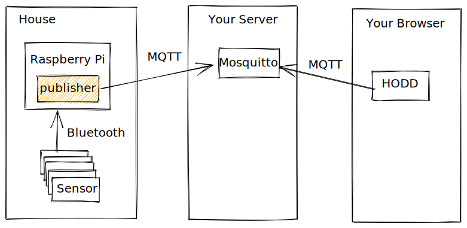

# About this project

This is a project for capturing BLE data from a Xiaomi Mijia 2
hygrometer-thermometer and publishing it. The repository includes:

- [A service](./mijia-homie) to connect to a number of Mijia sensors over BLE and publish their readings to an MQTT broker following the [Homie convention](https://homieiot.github.io/).
- [A service](./homie-influx) to discover devices on an MQTT broker following the [Homie convention](https://homieiot.github.io/) and record their property value changes to an InfluxDB database.
- [A library](./homie-device) for implementing Homie devices.
- [A library](./homie-controller) for implementing Homie controllers.
- [A library](./mijia) for reading Mijia sensors.
- [Generated bindings](./bluez-generated) for talking to BlueZ on Linux.

The project originated from a
[blog post](https://dev.to/lcsfelix/using-rust-blurz-to-capture-bluetooth-messages-9f-temp-slug-3838740?preview=259783675da772c58dae7c7ec5e06fd3e9746205826a13f6c39fcdefba2e37713113f2b21f1aeade314f556d37c2bc59e2c0b128499dd616d3622327),
and some ideas came from a
[Python utility for talking to the same sensors](https://github.com/JsBergbau/MiTemperature2),
especially [this issue thread](https://github.com/JsBergbau/MiTemperature2/issues/1).

If you want a bit more back-story, there is also a [slide deck](https://alsuren.github.io/mijia-homie/docs/presentation/).

## License

Licensed under either of

- Apache License, Version 2.0
  ([LICENSE-APACHE](LICENSE-APACHE) or http://www.apache.org/licenses/LICENSE-2.0)
- MIT license
  ([LICENSE-MIT](LICENSE-MIT) or http://opensource.org/licenses/MIT)

at your option.

## Contribution

Unless you explicitly state otherwise, any contribution intentionally submitted
for inclusion in the work by you, as defined in the Apache-2.0 license, shall be
dual licensed as above, without any additional terms or conditions.

## Setup

To run this code on your Raspberry Pi, you will need:

- Some Xiaomi Mijia version 2 Bluetooth temperature and humidity sensors.
- A working Rust toolchain and Docker on your laptop.
- An MQTT broker to connect to (test.mosquitto.org works okay for testing, but you will want to deploy your own if you're monitoring your house).
- Something to read the measurements from MQTT. [Homie Device Discovery](https://rroemhild.github.io/hodd/) is probably easiest for debugging.

After following these steps, you should end up with something that looks like this:

- Start by finding out which sensors you have:

      TARGET_SSH=pi@raspberrypi.local EXAMPLE=list-sensors ./run.sh

- Add each of the sensors to `/home/pi/sensor-names.toml` on the Raspberry Pi. Each line should be of the form:

      "A4:C1:38:D7:21:17"="Landing"

  If you don't know the sensor names yet, just make some names up for now.

- You will also want to copy `mijia-homie/mijia-homie.example.toml` to `/home/pi/mijia-homie.example.toml` and edit it to suit your needs.

- You should then be able to run the publisher using `run.sh` with default arguments:

      TARGET_SSH=pi@raspberrypi.local ./run.sh

  This will start the publisher under systemd and show you the logs.

- It takes a while to connect to all of the sensors and start getting readings. Once everything is running, you can use HoDD to see your readings.

- If everything is visible in HoDD then you can add other integrations. Anything that understands Homie should be able to read your sensors. OpenHAB is what we're using, but take a look at the [Homie Implementations page](https://homieiot.github.io/implementations/) and see if anything inspires you.
