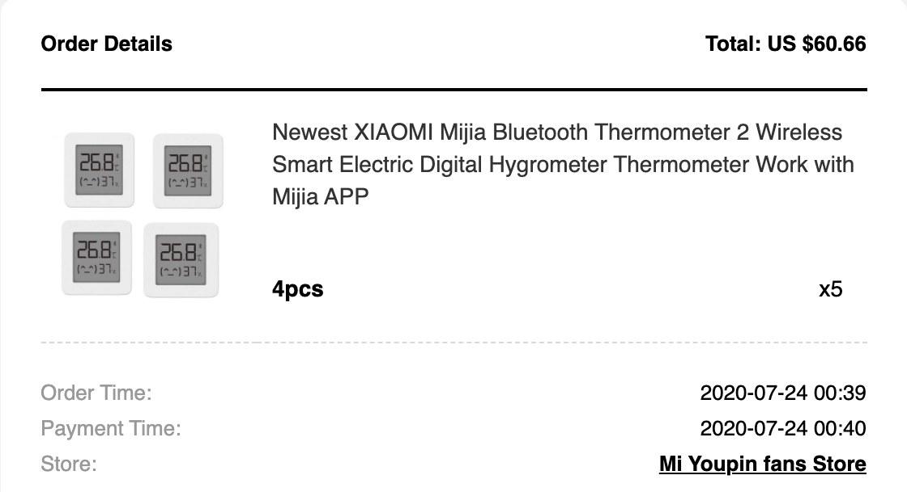
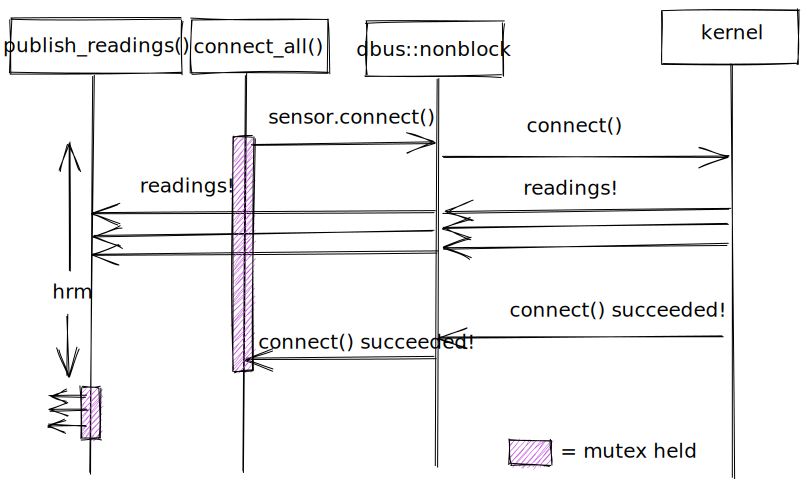

# Monitoring Temperature with Too Many Bluetooth Thermometers

- Binary Solo - 15th October 2020

- David Laban

 <!-- TODO: make this page look less shit -->

---

# Outline

- Backstory.

- System Overview.

- How it's built.

- Concurrency pitfalls.

- Observations about the project.

- Links and Questions.

---

# Backstory

- Housemate has a bunch of ESP32 sensors like this one

---

# Backstory

- "Wouldn't it be nice to have a hundred of these?"

- "Just imagine what you could do."

- "What's the cheapest way to do this?"

---

# Backstory

- So we bought some of these at `$3` each.

---

# Backstory

- And now we have graphs like this:

---

# Backstory

- And this:

---

# System Overview

<!--
- Sensors
- Raspberry Pi
- Mosquitto (MQTT broker)
- openHAB
- InfluxDB
- Grafana
  -->

<!-- TODO: raspberry pi talks over bluetooth and mqtt -->
<!-- TODO: explain that Mosquitto is an MQTT server, and that MQTT is pubsub with persistence and tombstones -->
<!-- TODO: theoretical openHAB replacement -->

- This is what it looks like:
  
- Bluetooth for talking to sensors.
- MQTT for pubsub.
- Influxdb for storage.

---

# MQTT

- MQTT is the pubsub of choice for low-powered gadgets.

- Has `retain`ed messages:

  - Lets you get the current status from the broker.

  - Avoids a round-trip to a power/network-constrained device.

- Has `LastWill` messages:

  - Lets the server clean up after you when you drop off the network.

- `rumqttc` library is pretty good:

  - Works using channels, which is nice.

  - You are responsible for polling its event loop.

  - Maintainers are pretty responsive.

---

# Bluetooth

The library landscape for bluetooth is a bit sad.

- `blurz`

  - Started with this.
  - Blocking `device.connect()` calls.
  - Not multithreaded (because of how it uses D-Bus).
  - Unmaintained (for 2 years)

- `btleplug`

  - Mostly Async.
  - Talks directly to bluetooth stack over a socket.
  - Tried switching to this (but gave up after a bunch of thread-panics).

- `dbus-rs`
  - Async or Blocking (depending on which interface you use).
  - Generates code from introspection on the Raspberry Pi.
  - Single-threaded in places (but that's okay).

---

# Concurrency

- Problem with single-threaded blocking bluetooth library:
  

---

# Concurrency

- Switch to async library:
  
- But you all know javascript, so I don't have to tell you this.

---

# Concurrency

- NOT SO FAST!
  
- What if all of your sensors live in a big `Arc<Mutex<SensorState>>`?

---

# Concurrency

- Hold the Mutex for as little time as possible.
  
- Much better.

---

# Concurrency (tools that we use)

- `Arc<Mutex<ALL THE THINGS>`

  - Fine as long as you're careful.

  - Only hold the mutex when you _need_ it.

- `Stream<Item = Event>`

  - Kinda fine.

  - Just the async version of Iter, but with less syntax support.

  - Not something that I use much in web-land.

- Unbounded Channels

  - Fine if you know it's not going to back up.

---

# Observations about the project

- Andrew is good at separating things into modules (and crates):

  - App -> Sensor (mijia) -> Bluetooth (bluez-generated) -> D-Bus.

  - App -> Homie (homie-device) -> MQTT.

  - [MQTT -> Homie (homie-controller) -> InfluxDB soon]

- Deployment

  - Cross-compiling with `cross` is okay to set up, but a bit slow.

  - Everything is supervised by systemd.

  - All managed by our `run.sh` script.

  - Test coverage is a bit thin. Sue me. 🤠

- Desktop Linux tech stack (D-Bus, Bluez) is still a shitshow.

- Raspberry Pi only supports 10 connected sensors (10 << 100).

---

# Links

- GitHub: https://github.com/alsuren/mijia-homie/

- Homie helper library https://crates.io/crates/homie-device

# Questions

- ?

--

# Question from me

- Does anyone have ideas about which graphs we should draw?
